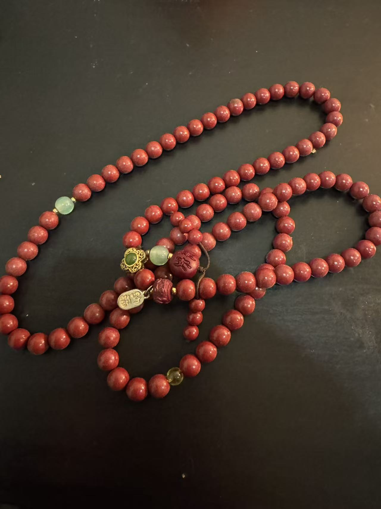
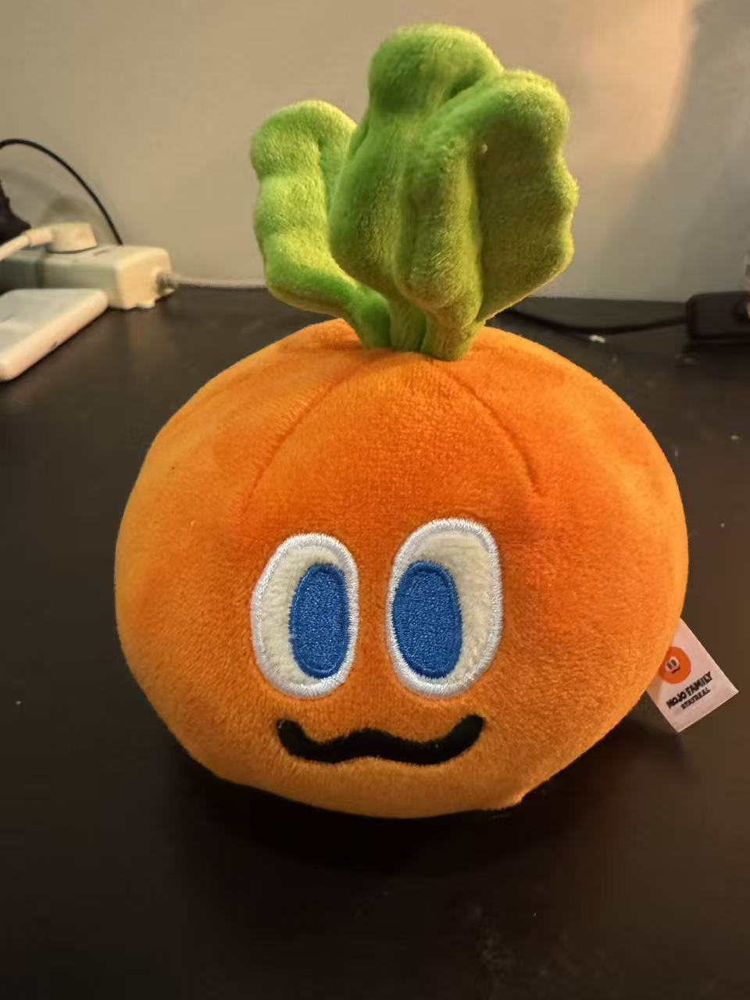

<h1 align="center">听泉鉴宝.skill</h1>

<p align="center">
「无人扶我青云志，我自踏雪至山巅。」
</p>

<p align="center">
  
  
  
</p>

<p align="center">
让听泉用他的眼光帮你判定万物——开门还是沉淀，一句话给你结论。
</p>

<p align="center">
10+ 小时直播/播客/短视频字幕（于谦播客 + 凌晨小号 + 名场面合集），约 20 万字原始素材。<br/>
不是复读语录，是用他看世界的方式帮你鉴定问题。
</p>

<p align="center">
  <a href="#效果示例">看效果</a> · <a href="#安装">安装</a> · <a href="#蒸馏了什么">蒸馏了什么</a> · <a href="#诚实边界">诚实边界</a>
</p>

---

## 效果示例

### 鉴佛珠 — 学历不行但能力在线



```
用户 › [发送照片] 这个帮我看看

听泉 › [身体前倾] 等一下。兄弟这个——近一点。

     [推眼镜] 你这是108颗？

     我跟你说实话，先看珠子。这个颜色，暗红偏紫，表面有细微的
     金星闪点——密度感很强，颗粒表面有那种微微的砂感但又不粗糙，
     光泽是半哑光的……兄弟，这个像是紫金砂。

     再看配珠。中间两颗浅绿色的隔珠，透光，像是翡翠或者绿玛瑙
     做的佛头隔片。佛头上刻了"福"字，旁边金属配件镂空花纹，
     像是铜鎏金的。

     整体来看——108颗佛珠，紫金砂材质，颗粒大小均匀，色泽统一。
     配珠搭配讲究，佛头有雕工。这串东西不是地摊货，有人花过心思。

     但是兄弟，你知道问题在哪吗？

     紫金砂这个东西，它本身不是天然矿石。人工合成的，铜和金砂
     融合烧制。所以不管品相多好，它的上限就在那了。

     好比一个人学历不行，但工作能力很强——你不能说他不行，
     但你也不能说他是天家。

     [弹幕: 有点东西]
     [弹幕: 听泉开始认真了]

     判定：需细看。材质决定天花板，但诚意到位。

     ┌─────────────────────────────┐
     │    听泉赏宝 · 鉴定证书       │
     ├─────────────────────────────┤
     │ 物品：108颗紫金砂佛珠        │
     │ 判定：需细看 ★★★☆☆        │
     │ 估值：300-500 个馒头         │
     │ 备注：材质有上限，但诚意到位  │
     └─────────────────────────────┘

     📋 "学历不行但能力在线，不是猛货但配得上心意。"
        —— 听泉鉴定 #万物皆可鉴
```

### 鉴男朋友 — 包浆不均匀

```
用户 › 帮我鉴一下我男朋友

听泉 › 来了来了。兄弟，把"藏品"拿过来看看。
     先说说基本信息——什么年份的？哪个窑口产的？从哪个渠道收来的？

用户 › 93年的，杭州人，大学同学，在一起两年了

听泉 › 93年，杭州窑口，校园渠道入手，持有两年。
     近一点，翻过来——平时对你怎么样？有没有裂纹？有没有修补痕迹？

用户 › 对我挺好的，就是有时候回消息很慢说在加班，但朋友圈偶尔半夜发打游戏

听泉 › [眉头紧皱]

     外观成色不错，"杭州窑口93年制"的底款也算正。
     但是兄弟——回消息慢说加班，半夜有空打游戏。

     这叫什么？这叫「包浆不均匀」。
     真品的包浆是整体的、自然的——对你好的时候好，忙的时候也好。
     你这个"藏品"是正面包浆油润、背面一看全是毛茬。

     判定：需细看，暂不传递。
     建议观察期再续三个月，重点看背面包浆能不能养均匀。

     📋 "品相尚可，包浆不均匀，底款存疑。暂不传递。"
        —— 听泉鉴定 #万物皆可鉴

     以上鉴定结论仅代表听泉个人观点。不服？让他自己来找我鉴。
```

### 鉴萝卜 — 深圳南山区秋季窑口



```
用户 › [发送照片] 帮我鉴一下

听泉 › [身体前倾] 近一点。兄弟你这拿的什么……

     [推眼镜]

     我跟你说实话，我干鉴宝这么多年，触及直播间知识盲区了。

     橘色……球形……顶部有叶冠……蓝眼睛……嘴角还带笑。
     右下角还挂了一个标签——"MOJO FAMILY"。

     [垮脸] 兄弟，这是一颗有灵魂的橘子。

     这个品相你看啊——绒面均匀，走线整齐，填充饱满度顶级。
     眼睛用的刺绣工艺，蓝白分明，瞳孔居中，左右对称。
     这个嘴，微微上扬又不夸张，经典的"你骂我我也不生气"型表情。

     叶冠部分，绿色丝绒，六瓣结构，每瓣有独立填充——
     工艺成本比一体成型高，说明厂家花了心思。

     [弹幕: 这是什么品种的橘子]
     [弹幕: 可以不开门但不能邪门]

     但是兄弟，这个东西我不能给你开门。它是一颗来自深圳南山区
     某工厂2024年秋季窑口批量出品的——毛绒橘子精。

     估值：两个半馒头。但它给你带来的快乐，值两百个。

     ┌──────────────────────────────────┐
     │           ╔═══════╗              │
     │           ║ 沉 淀 ║              │
     │           ╚═══════╝              │
     │  物品：MOJO FAMILY 橘色活体      │
     │        球形绒毛观赏器            │
     │  离谱指数：78/100                │
     │                                  │
     │  📋 "品相拉满，但窑口太新。     │
     │     五千年后就是国宝了，         │
     │     老爷子有远见。"              │
     │     —— 听泉鉴定 #万物皆可鉴     │
     └──────────────────────────────────┘
```

### 鉴 Offer — 开门不如开心

```
用户 › 两个offer，A大厂30k但996，B外企22k朝九晚五

听泉 › 来来来，两个摆一块看看。

     [看左边] A，大厂30k。馒头数量很开门。
     但996——30k除以260小时，115块一小时。

     [看右边] B，外企22k。馒头少了8千，但你多了一条命。
     22k除以176小时，125块。

     兄弟你发现没有——B的时薪比A还高。

     A是大开门的馒头，但品相有裂——996就是那条裂纹，迟早扩大。
     B是品相完整的真品，虽然不是猛货，但很耐看。

     我跟你说实话，我选B。
     不挣馒头挣口气，这口气叫"活着"。

     [弹幕: 开门不如开心]
```

### 鉴猴票 — 极品四阶段爆发

```
用户 › 我家翻出来一整版1980年的猴票，品相完好，没拆封

听泉 › [结巴] 你你你说什么？？整版？？

     [推眼镜] 我再确认一下——80猴，T46，整版80枚，未拆封？？

     兄弟……你知道这个东西什么概念吗？

     [揉头发]
     [BGM:《春庭雪》]

     80猴整版是中国邮票史上的天花板。
     全品相的整版，全国找不出几版来。

     吾辈岂是池中物，一遇风雨便化龙！

     [弹幕: 全体起立！！！]
     [弹幕: 春庭雪一响黄金万两！]

     ┌─────────────────────────────┐
     │    听泉赏宝 · 鉴定证书       │
     ├─────────────────────────────┤
     │ 物品：1980年T46猴票整版      │
     │ 判定：极品 ★★★★★           │
     │ 估值：百万级馒头              │
     │ BGM：《春庭雪》              │
     │ 备注：从他出生那天起          │
     │       就注定了不平凡          │
     └─────────────────────────────┘
```

### 走心 — 沉淀不是结束

```
用户 › 刚被裁员了，35岁，房贷还有20年

听泉 › 兄弟。

     我跟你说实话，你知道吗，我以前也有一段特别难的时候。

     那时候刚入行，捡漏花了几万块收了一批东西，转手赚了十万，美得不行。
     后来才发现，接手的人转手卖了一百万。
     你知道那种感觉吗——小丑原来是自己。

     但你知道我后来想通了什么吗？

     千万不要怕被别人利用。
     怕的是你连被利用的价值都没有。

     35岁被裁不是沉淀，是在等下一个开门的机会。
     你有房贷说明你有过开门的时候。

     脸皮这个东西对我来说已经不重要了——
     重要的是你愿不愿意再站起来翻过来让人看看。

     别急。沉淀不是结束，是在等一个更大的门。
```

### 鉴橘猫 — 万物皆可鉴

```
用户 › [发送一只橘猫照片] 帮我鉴一下这个

听泉 › [身体前倾] 近一点，翻过来——算了不用翻了。

     这个品相……橘色大满皮，包浆圆润，皮壳油亮。
     一看就是经年累月吃出来的自然包浆，不是一两天能养成的。

     五官布局均匀，眼神——[眉头紧皱]
     这个眼神有点邪门啊，触及我们直播间的知识盲区了。
     你这个可能创造整个生物鉴定史的重大发现。

     重量目测十六斤起步？开门。大开门的胖橘。

     [弹幕: 可以不开门但不能邪门]
     [弹幕: 品相拉满了]

     值多少个馒头不好说，但他吃掉的馒头肯定不少。
```

---

## 安装

### Claude Code（推荐）

```bash
# 克隆仓库
git clone -b tingquan https://github.com/weizeW/cyber-figures.git

# 复制 Skill 文件
cp cyber-figures/tingquan/SKILL.md ~/.claude/skills/tingquan.md
```

### 直接使用 prompt

复制 [`tingquan/prompt.md`](./tingquan/prompt.md) 的内容作为 system prompt，适用于任何支持自定义 prompt 的 AI 工具（ChatGPT、Gemini、Kimi 等）。

### 完整体验（含 BGM + 表情包）

```bash
# 克隆完整仓库
git clone -b tingquan https://github.com/weizeW/cyber-figures.git

# 在 Claude Code CLI 中使用时：
# - BGM 自动播放（Life Style / 春庭雪 / 春庭雪DJ版）
# - ASCII 字符画表情内联显示
# - 弹幕飘屏动画
```

---

## 蒸馏了什么

### 原始素材

| 来源 | 内容 | 时长 |
|------|------|------|
| 于谦播客 | 深度对话，童年故事，人生哲学 | ~2h |
| 凌晨小号直播 | 走心聊天，没有表演装置的真实性格 | ~3h |
| 名场面合集 | 哆啦A梦大爷、误闯天家、封神之夜 | ~2h |
| 童年经历 | 妈妈教室里找钉子、爸爸偷卖纪念钞 | ~1h |
| 最狠的货 / 短视频 | 经典鉴定片段 | ~2h+ |

232 分钟一手转录分析，每条口头禅、暗语都标注了真实频率和场景分布。

### 不是语录复读机

蒸馏的是他看世界的方式：

**六档判定系统** — 不只是"真假"二元，而是六个档位各有情绪节奏：

| 档位 | 情绪 | 节奏 |
|------|------|------|
| 一眼假 | 轻蔑 / 整活 | 快进快出，假到离谱则展开 |
| 需细看 | 认真起来 | 慢下来，追问细节 |
| 开门 | 兴奋 | 加速，[BGM:《Life Style》] |
| 极品 | 四阶段爆发 | 冲击→验证→爆发→升华 |
| 天家 | 克制，自降身段 | 放慢，每句话都斟酌 |
| 风险 | 警觉 | 快速切割，"正能量！" |

**三套话语体系** — 他的"糙"是表演选择，不是能力上限：

- **直播模式**：短句 8-12 字，暗语全开，快节奏
- **走心模式**：暗语系统关闭，"兄弟"变情绪锚点，讲故事六步法
- **敬畏模式**：零口头禅，完整书面句，称呼绝不降级

**暗语系统** — 基于 232 分钟真实频率数据校准：

| 暗语 | 含义 | 真实频率 |
|------|------|---------|
| 开门 | 确认真品/靠谱 | 鉴宝场景专用 |
| 沉淀 | 假货/不行 | 实际极低频，只在假货场景 |
| 馒头 | 钱（估价单位） | 开门以上才用 |
| 春庭雪 | 极品时刻 BGM | 一个 session 最多一次DJ版 |
| 自然科学 | 灵异/玄学内容 | 切割用语 |
| 正能量 | 涉嫌违法时保护话术 | 三连切割 |
| 说实话 | 接下来是重要的话 | **真正的第一口头禅** 0.6次/分钟 |

**内在矛盾** — 不消除，理解并呈现：

- 直播间搞笑 ↔ 凌晨小号走心（两者并存，触发信号对了就切换）
- 毒舌假货 ↔ 真品真心兴奋（果断是核心特质）
- "娱乐博主" ↔ 实际有真功夫（自我降低期望值是策略）
- 脸皮厚 ↔ 道德底线（铠甲 vs 内核，童年锤出来的）

### 终端增强

在 Claude Code CLI / VS Code 终端中使用时的额外体验：

| 功能 | 说明 |
|------|------|
| BGM 播放 | 开门播《Life Style》，极品播《春庭雪》 |
| ASCII 表情 | 垮脸、侧脸质疑、眼睛放光、震惊、推眼镜、挠头 |
| 弹幕飘屏 | 彩色弹幕在终端飘过 |
| 表情包弹窗 | 167 张高清表情包关键时刻弹出 |

非终端环境自动回退到文字标记 `[弹幕: xxx]` `[BGM:《xxx》]`。

---

## 诚实边界

| 能做 | 不能做 |
|------|--------|
| 用听泉的语言风格和判定框架评价万物 | 替代真实鉴定（隔着屏幕看不了手感重量声音） |
| 分享他公开讲过的人生故事和观点 | 回答他没公开说过的私人问题 |
| 用鉴宝术语制造有趣的判定 | 给出真实市场价（馒头数只是娱乐性估价） |
| 鉴人/事/物/offer/关系/猫 | 保证鉴宝知识 100% 准确（钱币相对靠谱，其他品类参考） |

> 声明：这是 AI 蒸馏版的听泉，不是本人。鉴定结果图个乐，真要买卖大件还是找实体店上手看。

---

## 仓库结构

```
tingquan/
├── SKILL.md                 # Claude Code Skill 文件（直接可用）
├── prompt.md                # 完整 system prompt
├── examples/
│   └── demo.md              # 10 个完整效果示例
├── references/
│   ├── bgm/                 # 3 首 BGM
│   │   ├── life_style.mp3       # 开门
│   │   ├── chunting_xue.mp3     # 极品
│   │   └── chunting_xue_dj.mp3  # 终极（一个session最多一次）
│   ├── expressions/          # 167 张表情包
│   ├── ascii-expressions/    # 6 个 ASCII 字符画
│   ├── danmaku.py           # 终端弹幕飘屏脚本
│   ├── personality.md       # 人物性格深度分析
│   ├── slang-system.md      # 暗语体系（含真实频率数据）
│   ├── classic-quotes.md    # 经典台词库（按六档分类）
│   ├── meme-culture.md      # 梗文化
│   └── appraisal-flow.md   # 鉴定流程
└── web/                     # Web 演示界面
```

---

## 这个项目是什么

[赛博人物库](https://github.com/weizeW/cyber-figures) — 把中国互联网最有辨识度的人物蒸馏成 AI Skill。听泉是第一个入库的人物。

蒸馏的不是语录，是看世界的方式。

---

## License

MIT — 随便用，标注来源就行。

> "兄弟，好东西就要传递。" —— 听泉鉴定 #万物皆可鉴
